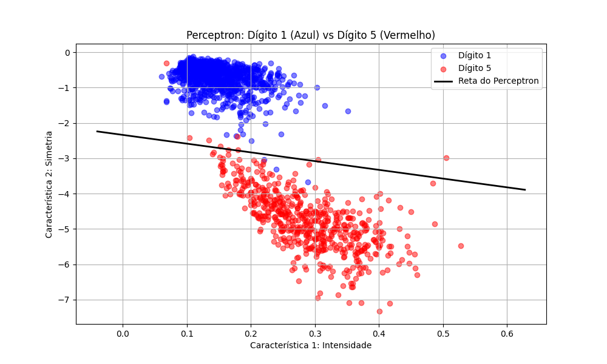

# 🧠 Perceptron do Zero: Classificação de Dígitos

Este projeto é uma implementação passo a passo de um **Perceptron** (classificador linear) construído do zero usando apenas Python e NumPy. O objetivo do modelo é classificar dígitos manuscritos, focando especificamente em distinguir o **Dígito 1** do **Dígito 5**.

## 🎯 O Desafio
Em vez de usar as imagens cruas, o modelo trabalha com duas características (features) extraídas previamente para permitir a visualização em 2D:
1. **Intensidade** (Feature 1)
2. **Simetria** (Feature 2)

Isso transforma o desafio em um problema bidimensional linearmente separável.

## 🛠️ Tecnologias Utilizadas
* `Python 3`
* `NumPy` (Matemática e manipulação de matrizes)
* `Matplotlib` (Visualização do gráfico de decisão)

## 🚀 Resultados do Modelo
Após treinar o modelo com o arquivo `digits.train` (1561 exemplos) por um máximo de 100 épocas com uma taxa de aprendizado de `0.1`, o modelo encontrou a seguinte reta de decisão:

* **Peso Intensidade ($w_1$):** 4.2246
* **Peso Simetria ($w_2$):** 1.7098
* **Bias ($b$):** 4.0000

O modelo foi então validado contra dados inéditos (`digits.test`):
* 🎯 **Acurácia no Treino:** 99.30%
* 🏆 **Acurácia no Teste:** 98.58%

### 📊 Visualização da Fronteira de Decisão
Abaixo está o gráfico gerado pelo modelo, mostrando a reta matemática separando os dados do Dígito 1 (azul) e do Dígito 5 (vermelho):



## 💻 Como executar
1. Clone este repositório.
2. Certifique-se de ter as bibliotecas instaladas: `pip install numpy matplotlib`
3. Rode o script principal:
```bash
python main.py