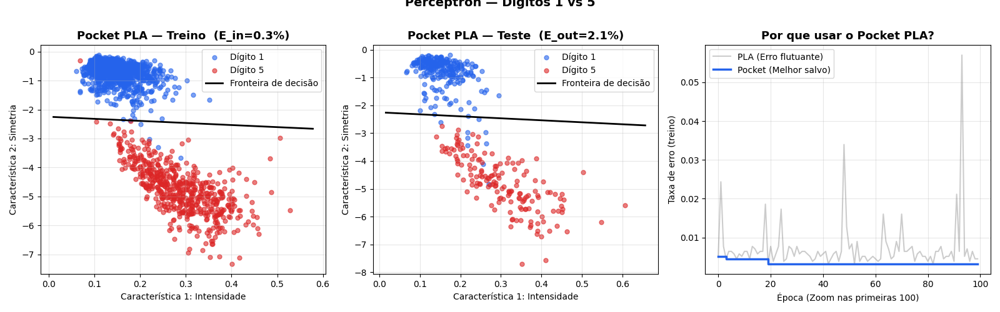

# 🧠 Pocket PLA: Classificação de Dígitos (1 vs 5)

Este projeto implementa do zero o algoritmo **Pocket PLA (Perceptron Learning Algorithm)** usando Python e NumPy. O objetivo é classificar dígitos manuscritos, focando em distinguir o **Dígito 1** do **Dígito 5**.

## 🎯 O Desafio e a Solução
Em vez de usar imagens cruas, o modelo trabalha com duas características (features) extraídas previamente para permitir a visualização em 2D:
1. **Intensidade** (Feature 1)
2. **Simetria** (Feature 2)

Como dados reais raramente são 100% linearmente separáveis, o PLA clássico não convergiria e entraria em loop infinito. Para resolver isso, foi implementado o algoritmo **Pocket PLA**, que "guarda no bolso" a melhor combinação de pesos encontrada ao longo das iterações, garantindo o menor erro possível e evitando o colapso do modelo.

## 🛠️ Tecnologias Utilizadas
* `Python 3`
* `NumPy` (Matemática e manipulação de matrizes)
* `Matplotlib` (Visualização dos gráficos e fronteiras de decisão)

## 🚀 Resultados do Modelo
O modelo foi treinado por 1000 épocas, com embaralhamento aleatório dos dados a cada época para evitar viés, e taxa de aprendizado de `0.01`.

* 🎯 **Treino ($E_{in}$):** Acurácia de 99.68% | Erro: 0.32% (1561 amostras)
* 🏆 **Teste ($E_{out}$):** Acurácia de 97.88% | Erro: 2.12% (424 amostras)

A proximidade entre o $E_{in}$ e o $E_{out}$ demonstra uma excelente capacidade de generalização do modelo, sem indícios de *overfitting*.

## 📊 Visualização
Abaixo está a comparação entre as fronteiras de decisão (no treino e no teste) e a curva de aprendizado provando a eficácia do Pocket PLA em estabilizar a taxa de erro em relação ao PLA padrão:



## 💻 Como executar
1. Clone este repositório.
2. Certifique-se de ter as bibliotecas instaladas: `pip install numpy matplotlib`
3. Rode o script principal:
```bash
python main.py